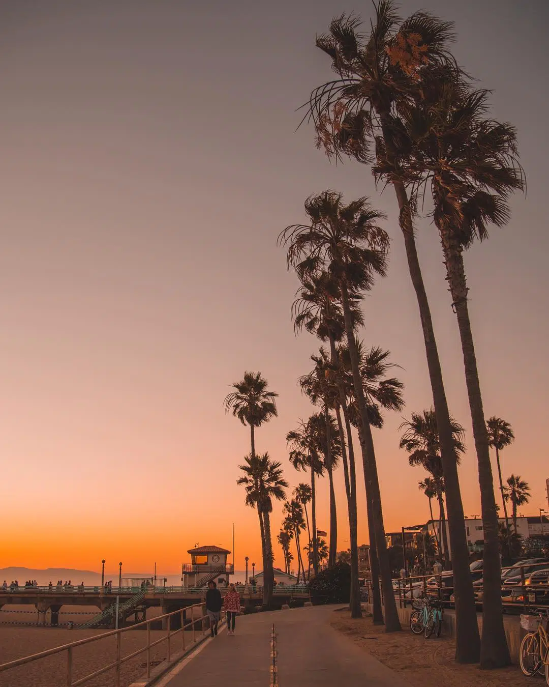

#Noshitha Reddy Gudhibandi

My favorite city to visit is Los Angeles. I like Los Angeles because of its beautiful beaches, warm weather, and exciting attractions.  The city has a unique combination of entertainment, nature, and different cultures.

 

-----
####Cities I Want to Visit 

I would like to visit these cities in the future because they have unique attractions, culture, and experiences.

| New City | Reason | Distance from Los Angeles | Travel Cost |
|----------|--------|---------------------------|-------------|
|New York|Time square, explore city| ~2500 miles| 500$|
|Miami|Warm weather ,beaches|~ 2500 miles|1000$|
|Washington D.C|Museums , gardens|~2500 miles|500$|
|Portland |Explore waterfalls, forests| ~960 miles | 300$|

-------
##### Favorite Jokes

**tom**
>"Why do they call it rush hour when nothing moves?"

**jerry**
>"A day without laughter is a day wasted"

--------
###### Code Snippet-Stopwatch Class

A class for measuring how long it takes for a program to run.

/**
 A class to measure time elapsed.
*/

public class Stopwatch {
    
    private long startTime;
    private long stopTime;

    private static final double NANOS_PER_SEC = 1_000_000_000.0;

    /**
     start the stop watch.
    */
    public void start() {
        startTime = System.nanoTime();
    }

    /**
     stop the stop watch.
    */

[Source: Stopwatch](https://www.cs.utexas.edu/~scottm/cs307/javacode/utilities/Stopwatch.java)

